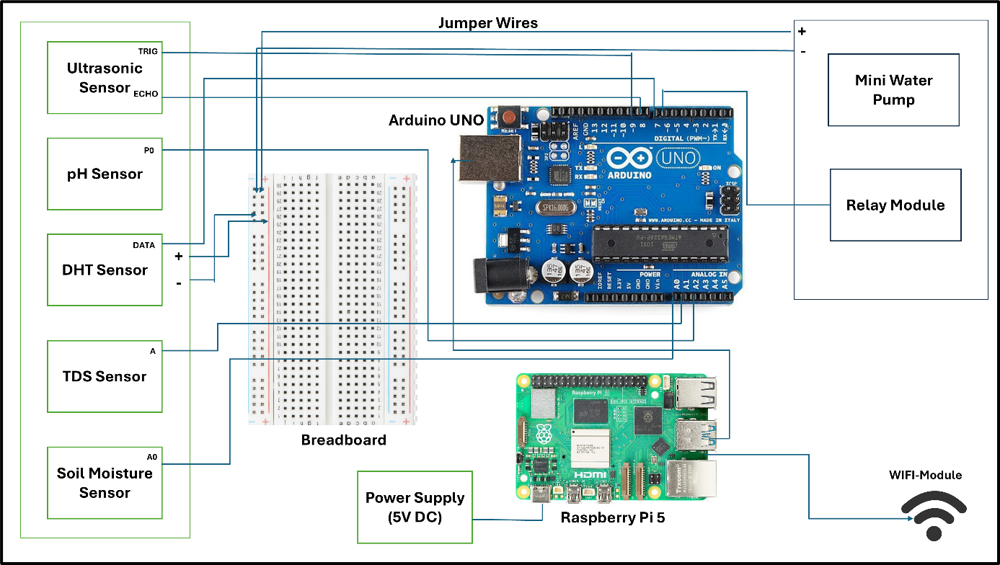

🌱 AI-Powered Automated Mineral Detection & Nutrient Infusion System

An IoT + AI-based smart agriculture system designed to automatically monitor soil conditions and deliver precise water and nutrients using a hybrid Arduino + Raspberry Pi architecture.

This project integrates hardware sensing, machine learning (Random Forest), and automated actuation to enable efficient and sustainable farming.

📄 Patent Information
Title: AI-Powered Automated Mineral Detection and Nutrient Infusion System
Application No.: 202511133394
Status: Published

This project represents the implementation and prototype of the patented system.

🚀 Project Overview
The system operates as a closed-loop intelligent control system:

Sensors collect real-time environmental and soil data
Arduino processes and forwards data
Raspberry Pi runs a Random Forest model
Predictions determine irrigation & nutrient needs
Pumps and valves are automatically triggered

## 🏗️ System Architecture

  

  <em>Figure: Arduino–Raspberry Pi based automated irrigation and nutrient infusion system</em>

🧠 Machine Learning Component
The system uses a Random Forest Classifier to predict plant health and resource requirements.

Key Features:
Binary classification: Healthy (0) vs Unhealthy (1)
Input parameters:
Temperature
Soil Moisture
Soil pH
TDS (Nutrients)
Humidity
Workflow:
Data preprocessing and cleaning
Train-test split (80–20)
Model training with optimized hyperparameters
Evaluation using:
Accuracy
Precision
Recall
F1 Score

⚙️ Hardware Architecture
Core Components:
Arduino Uno → Sensor data acquisition & actuator control
Raspberry Pi 5 → AI processing & communication
Sensors:
Soil Moisture
pH Sensor
TDS Sensor
DHT11 (Temp + Humidity)
Ultrasonic Sensor
Actuators:
Water Pump
Solenoid Valve
Relay Module

🔄 System Workflow
Sensors → Arduino → Raspberry Pi (AI Model)
        ← Control Signals ←
Arduino → Pumps & Valves → Soil

📊 Dataset
Synthetic dataset simulating real environmental conditions
Features include soil, environmental, and nutrient parameters
Used to train the Random Forest model

📈 Results
High classification accuracy on test data
Reliable prediction of plant health conditions
Efficient automated actuation based on model output

🔑 Key Features
Hybrid Arduino + Raspberry Pi architecture
Real-time sensor data acquisition
AI-based decision making (on-device)
Fully automated irrigation & nutrient delivery
Scalable and modular design
Low-cost implementation

🌍 Applications
Smart irrigation systems
Precision agriculture
Urban gardening
Greenhouse automation
Sustainable farming solutions

🛠️ Tech Stack
Hardware: Arduino Uno, Raspberry Pi 5
Languages: Python, C/C++ (Arduino)
Libraries:
scikit-learn
pandas
numpy
matplotlib
seaborn
Communication: UART

🔮 Future Work
Cloud dashboard for remote monitoring
Camera-based plant health analysis
Deep learning-based prediction models
Mobile application interface

👨‍💻 Authors
Chirag Jotwani
Chanchal Agrawal
Dr. Krishna Kant Pandey

📜 License
This project is intended for academic, research, and innovation purposes.
